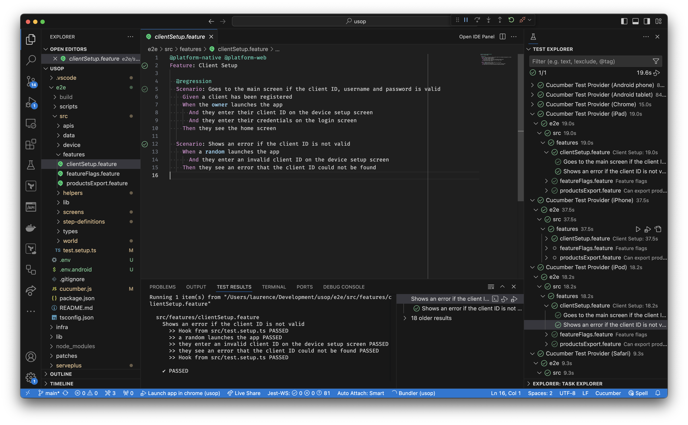

# Cucumber.js test explorer for VS Code

This extension uses the Test Explorer API in vscode to run your cucumber.js tests.



## Features

- Supports monorepos and multi-root workspaces
- Run your tests from feature files or the Test Explorer
- Debug your step definitions and support code with breakpoints
- Failures are parsed to provide links to source code
- Uses the [Cucumber.js javascript API](https://github.com/cucumber/cucumber-js/blob/main/docs/javascript_api.md) for tight integration.
- Performs a "dry run" to discover the tests that apply to your configuration(s)

## Requirements

- `@cucumber/cucumber` node module in your project.
- Some `*.feature` files.

## Extension Settings

This extension contributes the following settings:

| Key | Description | Default |
|--|--|--|
| `cucumberJsTestExplorer.cwd` | Working directory, relative to the workspace root | Workspace root |
| `cucumberJsTestExplorer.configFile` | Path to the cucumber.js configuration file, relative to cwd | The cucumber.js [default](https://github.com/cucumber/cucumber-js/blob/main/docs/configuration.md) |
| `cucumberJsTestExplorer.profiles` | Cucumber.js configuration profiles to use | None |
| `cucumberJsTestExplorer.envFiles` | .env files to load and pass to the cucumber.js runner, relative to cwd | None |
| `cucumberJsTestExplorer.env` | Environment variables to load and pass to the cucumber.js runner. Overrides any variables with the same name in .env files | None |

### Multiple configurations

The above configuration can be repeated multiple times under the `cucumberJsTestExplorer.virtualFolders` key to support multiple test controllers. This is useful for running different profiles or to support different test projects in a monorepo.

In this scenario the root level configuration (if supplied) is overridden by each virtual folder configuration.

**EXAMPLE**
```json
{
  "cucumberJsTestExplorer.cwd": "e2e",
  "cucumberJsTestExplorer.envFiles": [".env"],
  "cucumberJsTestExplorer.virtualFolders": [
    {
      "name": "Safari",
      "profiles": ["safari"]
    },
    {
      "name": "Chrome",
      "profiles": ["chrome"]
    },
    {
      "name": "iPad",
      "profiles": ["ipad"]
    },
    {
      "name": "Android phone",
      "profiles": ["android_phone"],
      "envFiles": [".env.android"]
    },
  ]
}
```

## Release Notes

See [CHANGELOG.md](./CHANGELOG.md)
